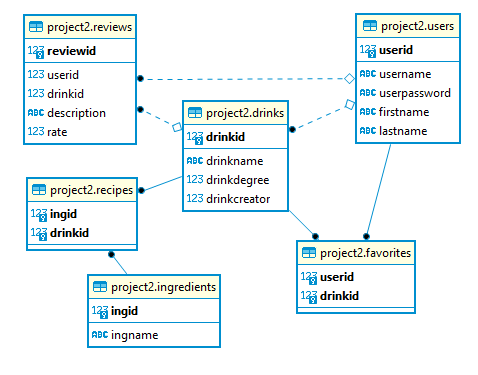

# Project2-Team7-FrontEnd
Project-2 View for team 7 using React with TypeScript 

## Project2-Team7-Backend Link
https://github.com/2011Canada/Project2-Team7-BackEnd

## Project Description
> Mixology-101 is a web-app which aimed to be the hub for cocktail recipe invention and sharing. This allows registered users and guests to take advantage of what the site has to offer; from browsing all creations to viewing and reviewing each drink's ingridient, preparation, rating alcohol content and more. Mixology-101 is built with React and Spring boot at its core and deployed through AWS EC2 instance.

## MIXOLOGY 101
> Creating a bright future for all next generation bartenders

## Overview
*“Turning Revature Devs to Mixologist”*

A Database backed Web-App that allows users (and guests*) to: 
- Create cocktail recipes 
- Update/Delete Recipes on personal creations
- Save Favorite Recipes
- Search and filter other creations/recipes *
- Rate each Recipe/cocktail.

### Technologies Used
- React - Ts
- PostgreSQL
- Hibernate
- Java
- WEB APIs (Stretch goal)
- Deployment Front-End (AWS S3)
- Deployment Server-Side (AWS EC2)

### Features (As implemented through user stories)

> [In general (guest) ]
- can filter by alcohol degree(%), rate, ingredient (vodka, gin )
- view user reviews on a drink

> [As a User]
- can register
- can login
- save favourite drinks:
- You can browse and select your favourite drink recipes
- Recipes can be saved on the users home page under a favourites tab
- (As a stretch goal) - users can share their favourite drinks to other users
- add your own custom drink 
- Fill out a dynamic form- (different recipes have different ingredients)
- Upload an image
- Users should have a specific place to view all the custom drinks that they have added onto the sight
- Added drinks can be viewed by all who browse the web-app
- Users can update/edit their creations, as well as remove them from the site
- review/rate a recipe  
- Users can review drinks, write a description and rate the drink.
- All people accessing the web-app can see the reviews
- Only logged in users can submit and add a review
- All the reviews are saved under the drink that was being reviewed

> [As a System]
- Store logs

## Getting Started
- Windows/Mac Git Clone Command:
> Git clone https://github.com/2011Canada/Project2-Team7-FrontEnd.git
- Download and install NPM.  
> $npm install -g npm
- Download dependencies
> ? $npm install
- Start the program
> $npm start

### Stretch Goals 
- Users signed up can share their drinks with other users. 
- Stretch stretch goal: profile sharing
- Api to get bar locations
- Api for getting data about different drinks (https://www.thecocktaildb.com/api.php)
- What foods go well with what drink 
- Share on social media platform a custom recipe/ fav drink

### ERD

